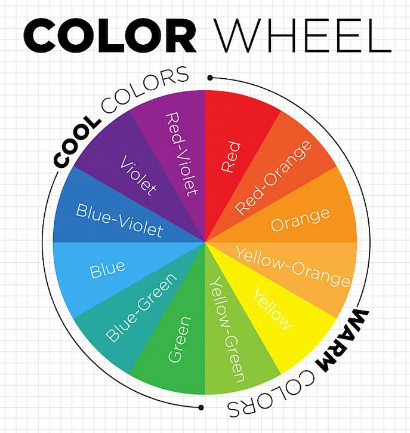
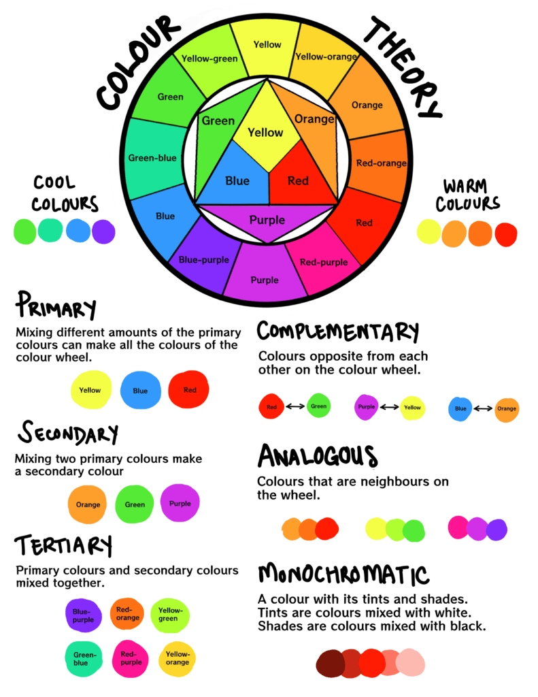
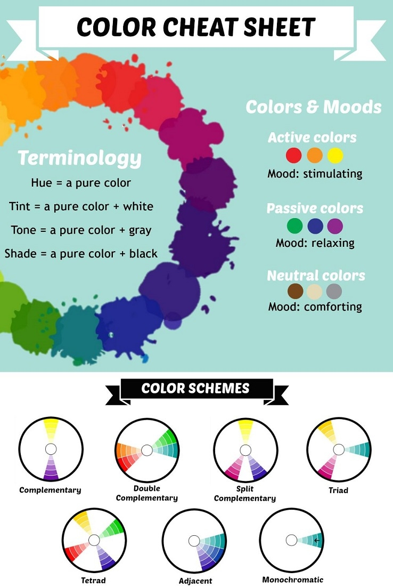
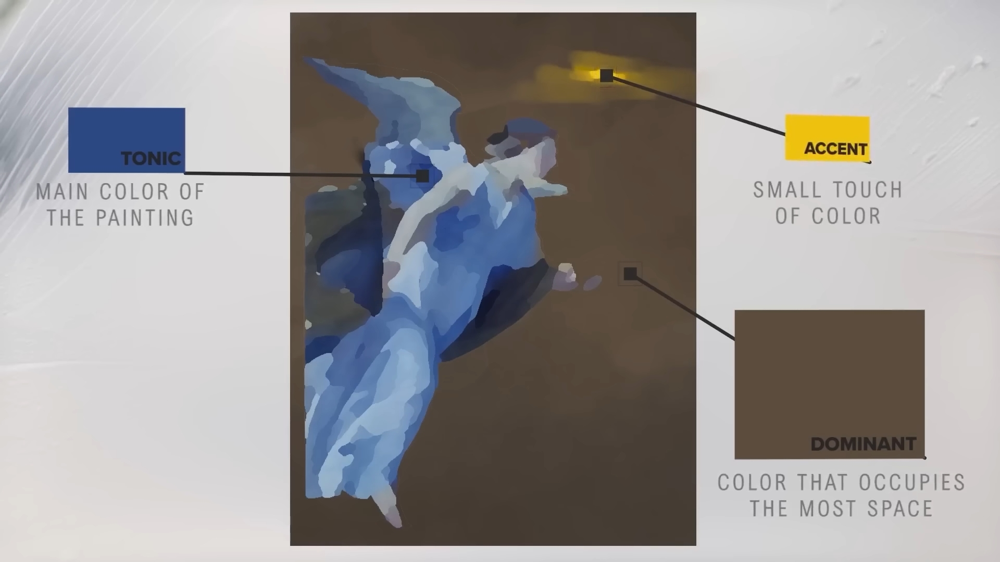
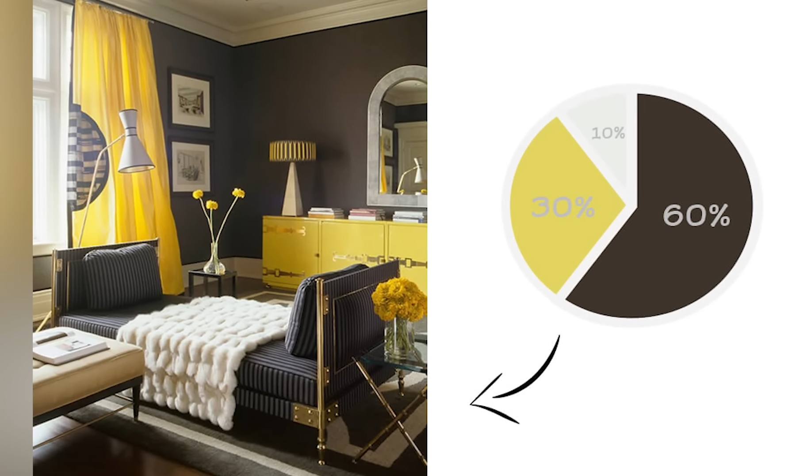
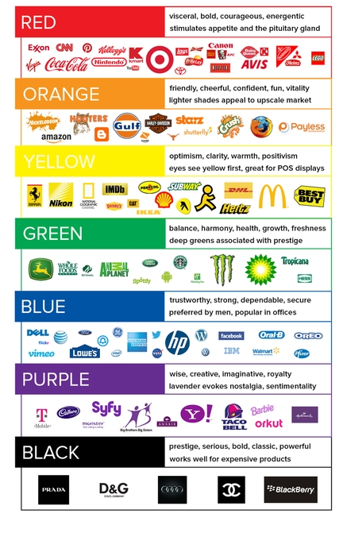
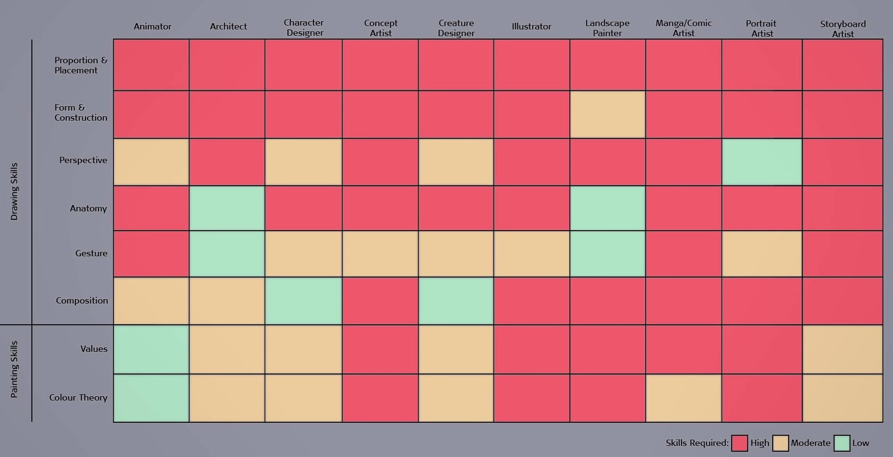

# Cheatsheets for 3D Art.

<!-- [:arrow_down: Tags legend](#tags-legend) at the end of the page. -->

<!-- -  by  ( _:movie_camera:_ ) -->

## Orthographic vs Perspective

( _math_ ) ( _transformation_ )

## Perspective Explained

( _math_ ) ( _transformation_ )

## Color Theory

( _math_ ) ( _transformation_ )

<!--  -->
<!--  -->

## Color Theory: Tonic / Dominant / Accent

## Emotions of Colors

## Drawing Skills vs Roles Matrix

